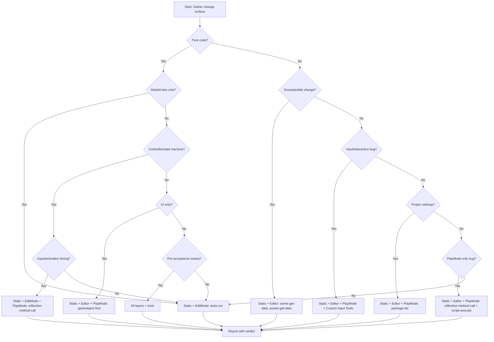

# Route Matrix
<!-- 路由矩阵：根据变更类型选择验证层级 -->

Use this file to map a change to the minimum reliable validation stack.

## Decision Flowchart



## Preflight
<!-- 预检查：路由前先回答这些问题 -->

Before routing, answer these questions:

1. Which files changed? — 改了哪些文件？
2. Is this pure code, or does it depend on scene/prefab/editor state? — 纯代码还是依赖场景/预制体/编辑器状态？
3. Is the bug visible only during PlayMode? — bug只在PlayMode可见？
4. Does the symptom involve input, animation timing, or state transitions? — 症状涉及输入、动画时机、状态转换？
5. Is this a local regression check or a pre-acceptance pass? — 是本地回归检查还是预验收？
6. Is Unity-MCP connected and ready? — Unity-MCP 是否已连接并就绪？

## Layer Legend
<!-- 层级说明 -->

| Layer | Description | Unity-MCP Tools | Cost |
|-------|-------------|-----------------|------|
| `Static` | 读diff，检查代码路径，审查不变量 | 无需 MCP | 最低 |
| `EditMode` | 运行确定性测试或添加最小测试 | `tests-run` | 低 |
| `Editor` | 编译、层级、预制体、检视面板、日志、序列化连线、**UI DOM 树检查** | `script-execute`, `scene-*`, `gameobject-*`, `assets-*`, `console-get-logs`, **`ui-hierarchy-snapshot`**, **`ui-element-find`** | 中 |
| `PlayMode` | Layer 4 包含三个子流程 + 前置/后置步骤：<br>**4A-Pre**: 状态重置<br>**4A**: 进入/退出 PlayMode<br>**4B**: 输入模拟 + 测试后门<br>**4B-Post**: 等待状态稳定<br>**4C**: 证据收集（截图 + UI 快照 + 状态探针） | **4A-Pre**: `state-reset`, `reflection-method-call`<br>**4A**: `editor-application-*`<br>**4B**: `simulate-*`, `record-*`, `replay-*`, `reflection-method-call` (后门)<br>**4B-Post**: `wait-until-condition`, `wait-for-animation-state`, `wait-for-stable`<br>**4C**: `screenshot-*`, `ui-hierarchy-snapshot`, `reflection-*`, `script-execute`, `console-get-logs` | 高 |

**重要规则（v2.0）：**

1. 输入/交互类验证必须包含 Layer 4B（输入模拟）。例如：
   - 三消游戏滑动消除 → 需要 `simulate-drag-world`
   - 按钮点击 → 需要 `simulate-click-ui`
   - 键盘快捷键 → 需要 `simulate-key-press`
2. **交互操作后必须使用 wait-until-condition 等待状态稳定**，禁止写死 Thread.Sleep
3. **多个 PlayMode 测试用例之间必须执行状态重置**（4A-Pre）
4. **UI 验证必须配合 ui-hierarchy-snapshot 做数据断言**，不能只靠截图

## Routing Table
<!-- 路由表：变更类型 → 必需层级 → Unity-MCP工具 -->

| Change class | Common signals | Required layers | Unity-MCP tools focus |
| --- | --- | --- | --- |
| **Model / rules** 模型/规则 | model classes, business logic, scoring, calculation, rules | Static, EditMode | `tests-run` 确定性规则正确性，边界情况 |
| **Controller / state machine** 控制器/状态机 | controller, state machine, phase changes, event flow | Static, EditMode, PlayMode (4A-Pre+4A+4C) | `tests-run`, `state-reset`, `wait-until-condition`, `reflection-method-call` 检查状态转换，回调，解锁时机 |
| **Input / interaction** 输入/交互 | click, drag, touch, selection, input handling, **滑动消除** | Static, Editor, **PlayMode (4A-Pre+4A+4B+4B-Post+4C)** | **[4A-Pre] `state-reset`** + **[4B] `simulate-click-*`, `simulate-drag-*`, `replay-input`** + **[4B-Post] `wait-until-condition`** + [4C] `screenshot-*`, `ui-hierarchy-snapshot`, `reflection-method-call` **三消滑动验证：state-reset → simulate-drag-world → wait-until-condition → screenshot + ui-snapshot → reflection-method-call 检查分数** |
| **Animation / input lock** 动画/输入锁 | tween, coroutine, async sequence, lock/unlock timing | Static, PlayMode (4A-Pre+4A+4B-Post+4C) | `state-reset`, `editor-application-set-state`, `wait-for-animation-state`, `wait-until-condition`, `reflection-method-call`, `screenshot-*` 动画完成，锁释放，卡住阶段 |
| **Scene / prefab / inspector wiring** 场景/预制体/连线 | `Assets/Scenes`, `Assets/Prefabs`, serialized references | Static, Editor | `scene-get-data`, `gameobject-find`, `assets-get-data`, `gameobject-component-get`, `ui-hierarchy-snapshot` 缺失对象，缺失组件，空字段，错误引用 |
| **UI / HUD** 界面 | buttons, labels, UI canvas, menus | Static, Editor, **PlayMode (4A-Pre+4A+4B+4B-Post+4C)** | **[4B] `simulate-click-ui`** + **[4B-Post] `wait-for-frame-count`** + [4C] `screenshot-game-view`, **`ui-hierarchy-snapshot`**, `reflection-method-call` UI按钮点击验证 + UI DOM 数据断言 |
| **Project settings / package backend** 项目设置/包后端 | `ProjectSettings`, `Packages`, Input System, render pipeline | Static, Editor, PlayMode (4A-Pre+4A+4C) | `state-reset`, `package-list`, `script-execute`, `tests-run` 编译，后端兼容性，运行时输入路径 |
| **PlayMode-only runtime bug** 仅运行时bug | "works for a while", "after some actions", "freezes", "no response" | Static, Editor, PlayMode (4A-Pre+4A+4B+4B-Post+4C) | **[4A-Pre] `state-reset`** + [4B] `record-*`, `replay-input` 复现 + **[4B-Post] `wait-for-stable`** + [4C] `console-get-logs`, `reflection-method-call`, `screenshot-*`, `ui-hierarchy-snapshot` 日志，运行时状态探针，UI 状态断言 |
| **Pre-acceptance sweep** 预验收检查 | "ready to accept", "before merge", "full verification" | Static, EditMode, Editor, **PlayMode (4A-Pre+4A+4B+4B-Post+4C)** | 全流程验证，包含状态重置、输入模拟、等待稳定、UI 快照断言 |

## File Path Hints
<!-- 文件路径提示：根据路径推断变更类型 -->

Use these file patterns as routing hints when the request is vague. Customize for your project:
<!-- 根据你的项目自定义 -->

```
Model / rules 模型/规则:
  - Scripts that contain domain logic, business rules, or data models
  - 包含领域逻辑、业务规则或数据模型的脚本

Controller / state machine 控制器/状态机:
  - Scripts that manage game flow, state transitions, or orchestrate behavior
  - 管理游戏流程、状态转换或编排行为的脚本

Input / interaction 输入/交互:
  - Scripts that handle player input, clicks, drags, or touch events
  - 处理玩家输入、点击、拖动或触摸事件的脚本

Animation / timing 动画/时机:
  - Scripts that control tweens, coroutines, or timed sequences
  - 控制补间动画、协程或定时序列的脚本

Scene / prefab wiring 场景/预制体连线:
  - Assets/Scenes/**
  - Assets/Prefabs/**

UI / HUD 界面:
  - Scripts that update UI elements, canvases, or menus
  - 更新UI元素、画布或菜单的脚本

Project settings / backend 项目设置/后端:
  - ProjectSettings/**
  - Packages/**
```

## Escalation Rules
<!-- 升级规则：什么时候必须用更贵的层 -->

### When EditMode is enough
<!-- EditMode 就够的情况 -->

EditMode may be enough when:

- the change is pure rules/model logic — 变更是纯规则/模型逻辑
- no scene, prefab, input, animation, or runtime state is involved — 不涉及场景、预制体、输入、动画或运行时状态
- the acceptance criteria are deterministic and already covered by tests — 验收标准是确定性的且已有测试覆盖

### When PlayMode is mandatory
<!-- 必须用 PlayMode 的情况 -->

PlayMode is mandatory when:

- the user mentions clicks, touches, dragging, or buttons — 用户提到点击、触摸、拖动或按钮
- the failure depends on tween timing or input lock timing — 失败依赖于补间时机或输入锁时机
- the bug appears only after interacting with the game — bug只在交互后才出现
- scene/prefab setup can influence runtime behavior — 场景/预制体设置可能影响运行时行为
- the feature must be shown as actually runnable — 功能必须展示为实际可运行

### When Editor inspection is mandatory
<!-- 必须用 Editor 检查的情况 -->

Editor inspection is mandatory when:

- scripts depend on serialized references — 脚本依赖序列化引用
- a prefab or scene object might be missing a component — 预制体或场景对象可能缺失组件
- Input System or package settings changed — 输入系统或包设置已更改
- UI objects or event routing might be miswired — UI对象或事件路由可能接线错误

## Unity-MCP Tool Selection Guide
<!-- Unity-MCP 工具选择指南 -->

### For compiling/testing
<!-- 编译/测试 -->

| 场景 | 推荐工具 |
|------|----------|
| 编译并执行代码片段 | `script-execute` |
| 运行 EditMode 测试 | `tests-run mode=EditMode` |
| 运行 PlayMode 测试 | `tests-run mode=PlayMode` |

### For scene/prefab inspection
<!-- 场景/预制体检查 -->

| 场景 | 推荐工具 |
|------|----------|
| 检查场景层级 | `scene-get-data` |
| 查找特定对象 | `gameobject-find` |
| 检查组件状态 | `gameobject-component-get` |
| 检查预制体引用 | `assets-get-data` |
| **检查 UI 元素结构** | **`ui-hierarchy-snapshot`** |
| **查找特定 UI 元素** | **`ui-element-find`** |

### For runtime probing
<!-- 运行时探针 -->

| 场景 | 推荐工具 |
|------|----------|
| 进入 PlayMode | `editor-application-set-state playMode=true` |
| **重置游戏状态** | **`state-reset`** 或 `reflection-method-call` (TestHelper.ResetAll) |
| **等待状态稳定** | **`wait-until-condition`** |
| **等待动画完成** | **`wait-for-animation-state`** |
| **等待 UI 布局重建** | **`wait-for-frame-count frameCount=2`** |
| 获取日志 | `console-get-logs` |
| 截图 | `screenshot-game-view` |
| **UI DOM 树快照** | **`ui-hierarchy-snapshot`** |
| 检查运行时状态 | `reflection-method-call` 或 `script-execute` |
| 调用任意方法 | `reflection-method-call` |
| **构造边界测试场景** | **`reflection-method-call`** (调用 TestHelper 后门方法) |

### For state isolation (v2.0)
<!-- 状态隔离 -->

| 场景 | 推荐工具 |
|------|----------|
| 测试前重置状态 | `state-reset strategy="auto"` |
| 确认重置成功 | `wait-until-condition condition="GameController.Instance != null"` |
| 测试间清理 | `reflection-method-call` (TestHelper.ResetAll) |

## Review Prompts
<!-- 审查提示：路由时要问的问题 -->

During routing, always ask these internal questions:

1. Can the model and view become desynchronized? — 模型和视图会不同步吗？
2. Can input remain locked forever on any failure path? — 任何失败路径上输入会永远锁定吗？
3. Can an async operation or callback fail to restore state? — 异步操作或回调会无法恢复状态吗？
4. Can the current scene/prefab state make the code look broken even if scripts compile? — 当前场景/预制体状态会让代码看起来坏了即使脚本编译通过？
5. Does the route include enough runtime evidence to explain "stops responding after some actions"? — 路由是否包含足够的运行时证据来解释"某些操作后停止响应"？